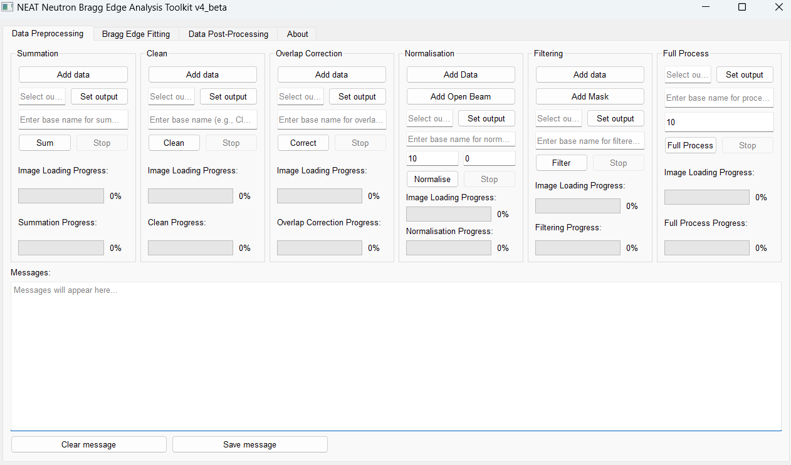
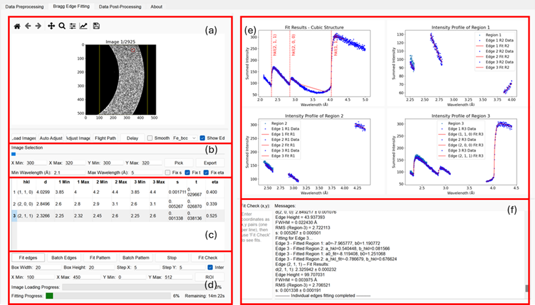
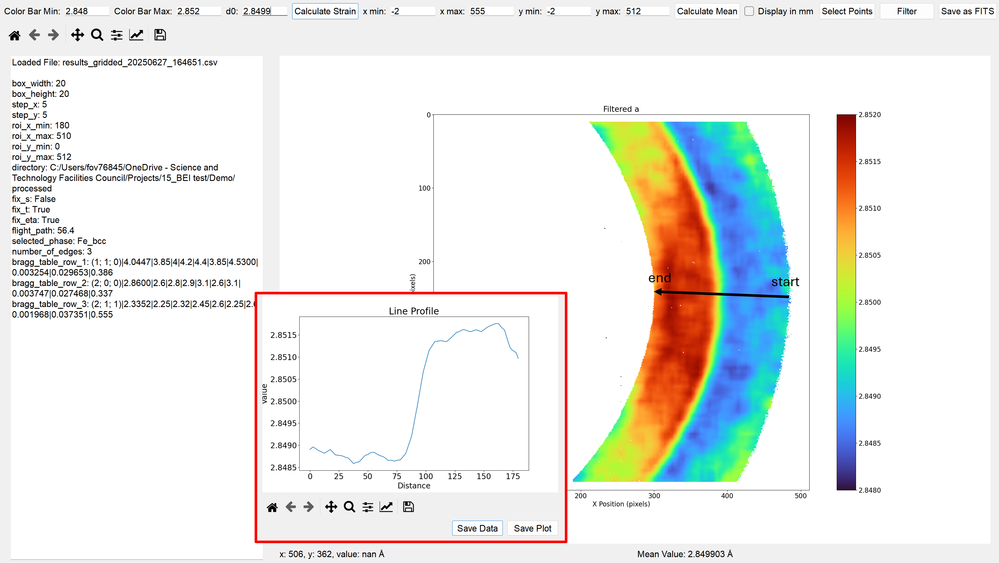
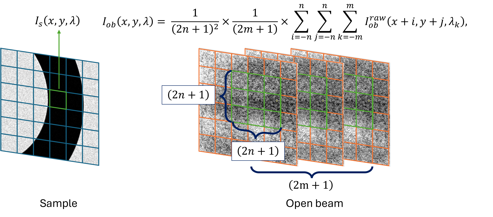
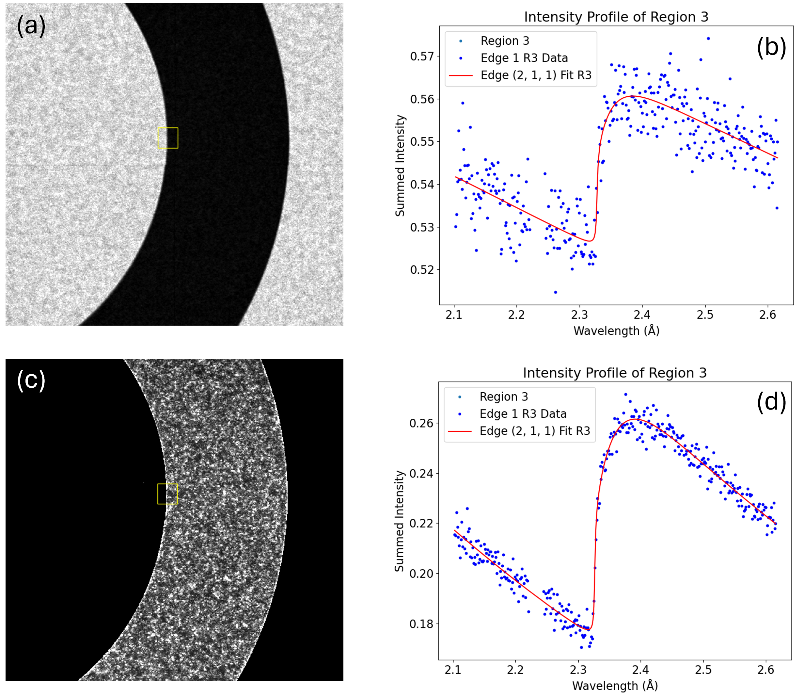
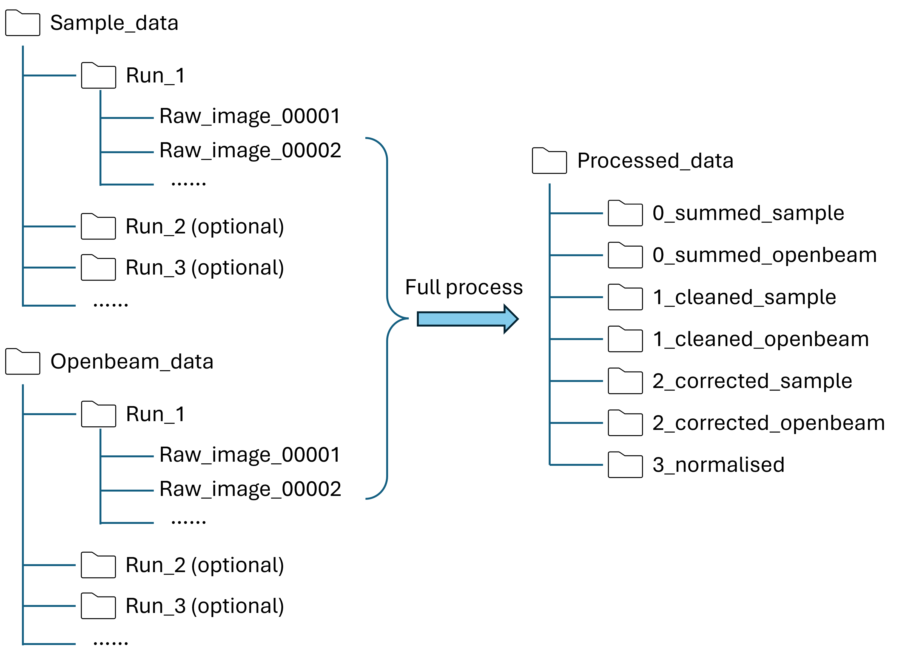
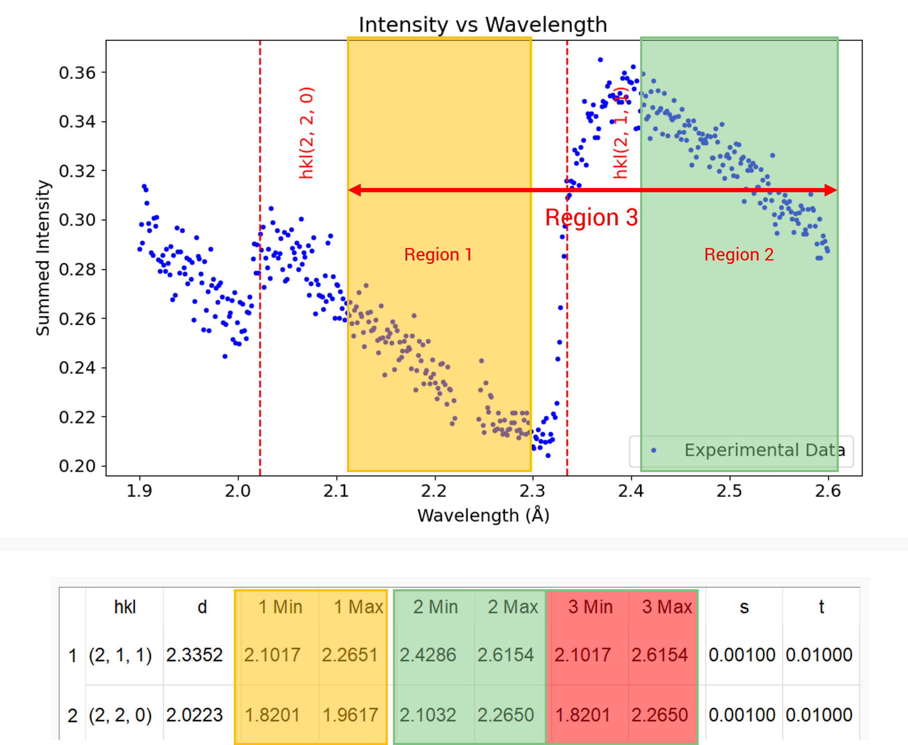
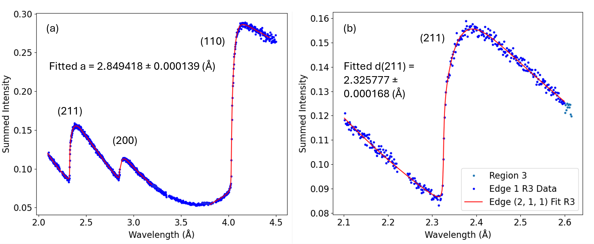

# NEAT User Manual

## Video tutorials are available on Youtube:

**Data Preprocessing:**

[](https://www.youtube.com/watch?v=396dxUIt5Mo)

**Data Preprocessing - full process:**

[](https://www.youtube.com/watch?v=ycSKno3tYpY)

**Bragg Edge Fitting and Mapping:**

[](https://www.youtube.com/watch?v=fbucLB5Bypc)

**Data Post-processing:**

[](https://www.youtube.com/watch?v=TB_vlNWM744)

## Example dataset for Bragg edge fitting
An example dataset is available for Bragg edge fitting tutorial, click to download [Example_dataset](https://github.com/RayZhang2024/NEAT/releases/download/v4.6/5_Ubend_normalised.zip). The dataset has been pre-processed and is ready for Bragg edge fitting, go and have a try!

# 1. Introduction

## 1.1 Overview

NEAT (Neutron Bragg Edge Analysis Toolkit) is an open-source Python-based graphical user interface (GUI) designed for Bragg-edge neutron imaging data analysis. It enables users to visualise, fit, and interpret wavelength-resolved transmission data collected from neutron imaging beamlines such as IMAT (ISIS Neutron and Muon Source).

The software provides a streamlined workflow that integrates data loading, edge fitting, mapping, and batch processing — allowing both scientific and industrial users to efficiently extract quantitative information such as lattice spacing and residual strain from transmission spectra.

## 1.2 Purpose and Motivation

Bragg-edge imaging is a powerful neutron technique that reveals material structure and strain information through energy-resolved transmission. However, the analysis of such data is often time-consuming and requires specialised knowledge of fitting functions and image handling.

NEAT was developed to:

Simplify the analysis process for both new and experienced neutron users.

Provide a consistent and reproducible data analysis workflow.

Offer interactive visualisation tools to inspect transmission spectra, edge positions, and strain maps.

Facilitate collaboration and reproducibility through open-source code and transparent fitting algorithms.

## 1.3 Key Features

User-friendly GUI: intuitive layout for spectrum viewing, ROI selection, and batch analysis.

Flexible fitting functions: pseudo-Voigt model used, Jørgensen Bragg-edge models is planned to included in the future.

Result visualisation: generate maps of lattice spacing, strain, and fit quality.

Export tools: save fitted parameters and spectra as CSV.

## 1.4 Typical Workflow

Load Data: Import wavelength-resolved transmission files (.fits).

Select ROI: Choose single points or regions for analysis.

Fit Bragg Edges: Apply fitting models to extract lattice spacing.

Visualise Results: Display fitted edges and 2D maps.

Export Output: Save results for further analysis or publication.

## 1.5 Intended Users

NEAT is intended for:

Researchers and engineers performing Bragg-edge imaging experiments.

Beamline scientists conducting in-situ studies at neutron imaging facilities.

Industrial users analysing strain, phase evolution, or microstructural variations in materials.

---

# 2. GUI Overview

NEAT’s graphical user interface (GUI) integrates the entire Bragg-edge imaging workflow — from loading and preprocessing data to edge fitting, mapping, and post-processing — within a single interactive environment. It consists of three major tabs: data preprocessing, Bragg edge fitting, and data post processing.

## 2.1 Data Preprocessing Tab

The Data Preprocessing tab is the first step in the NEAT workflow. It consolidates all image-level corrections and normalisation steps needed before Bragg-edge fitting.
Each panel corresponds to a specific operation in the preprocessing chain, and users can execute them individually or as a complete automated batch using the Full Process module.


| **Panel**               | **Purpose**                                                                                                      |
| ----------------------- | ---------------------------------------------------------------------------------------------------------------- |
| **Summation**           | Combines multiple raw run files into one dataset to improve signal-to-noise ratio (SNR).                         |
| **Clean**               | Detects and replaces dead or hot pixels in the images using thresholding and spatial averaging.                  |
| **Overlap Correction**  | Corrects pixel pile-up effects in Timepix detectors, restoring accurate short-wavelength intensities.            |
| **Normalisation**       | Normalisation by dividing the corrected sample stack by the corrected open-beam reference.                       |
| **Filtering (Masking)** | Optionally filters data to exclude invalid regions by a binary mask.                                             |
| **Full Process**        | Automates all preprocessing steps sequentially for datasets, from summation to normalisation.                    |



---

## 2.2 Bragg Edge Fitting Tab

| **Section**                       | **Purpose**                                                                                                                                                                                                                          |
| --------------------------------- | ------------------------------------------------------------------------------------------------------------------------------------------------------------------------------------------------------------------------------------ |
| **(a) Viewport**                  | Displays the loaded image and allows users to define a **Region of Interest (ROI)** interactively. The ROI determines which pixels or macro-pixels are used for spectral extraction.                                                 |
| **(b) Spectrum-Extraction Panel** | Sets the **macro-pixel size** (e.g. 10 × 10 pixels) and **wavelength range** for fitting. Pressing **Pick** extracts and displays the averaged transmission spectrum from the selected ROI.                                          |
| **(c) Bragg-Edge Table**          | Lists all theoretical Bragg edges within the chosen wavelength range for the selected phase. Each row includes editable left/right/edge windows and model parameters (*s*, *t*, *η*), which can be fixed or refined.                 |
| **(d) Fitting Controls**          | Provides main fitting commands — **Fit edges** (individual three-stage fits), **Fit pattern** (multi-edge fitting with shared lattice parameter *a*), and **Batch Edges / Batch Pattern** for automated high-throughput ROI mapping. |
| **(e) Right-Hand Canvas**         | Displays extracted transmission spectra, fitted curves, and residuals. Updates occur in real time after each fit to enable rapid assessment of fit quality.                                                                          |
| **(f) Message Pane**              | Shows numerical results, fitting statistics, and diagnostic information. Also reports batch-processing progress and status messages during fitting operations.                                                                       |




---

## 2.3 Data Post Processing Tab


| **Section**                     | **Purpose**                                                                                                                                                                                                                    |
| ------------------------------- | ------------------------------------------------------------------------------------------------------------------------------------------------------------------------------------------------------------------------------ |
| **Batch-Fitting Data Import**   | Allows the user to load previously saved batch-fitting results (CSV file) containing fitted parameters such as lattice parameter *a*, Bragg-edge position, or strain.                                                          |
| **Metric Selection**            | Enables the user to choose which fitted parameter to visualise — for example, lattice parameter *a*, edge shift, or intensity. The selected metric determines the data displayed in the 2D map.                                |
| **2D Map Rendering**            | Displays a spatially resolved map of the chosen metric over the defined ROI, providing an intuitive visualisation of parameter distribution across the sample. A dynamic colour scale bar indicates quantitative values.       |
| **Line Profile Extraction**     | Lets the user select two points on the 2D map to define a line path. The corresponding variation of the metric along this line is plotted in a **pop-up window**, allowing detailed analysis of local gradients or interfaces. |
| **Export and Analysis Options** | Offers options to save the generated 2D maps and line-profile plots for further documentation, reporting, or comparison with simulation results.                                                                               |




---
# 3 Data Preprocessing
## 3.1 Summation

* Combines multiple **runs of FITS images** by **pixel-wise addition** to boost SNR.
* If you don't have multiple **runs**, simplely skip this step.
* Supports batch processing for multiple samples.
* Writes the **summed images** into a chosen output folder with your **base name**.

1) Quick strat (2-level example)

1. **Add data** → choose the containing `/Run_01`, `/Run_02`, `/Run_03`.
2. **Set output** → choose a folder that will store the summed images.
3. **Base name** → i.e. `Fe_summed`.
4. **Sum** → wait for both progress bars to finish.
5. Find results at:

   ```
   /Results/Summed_TopFolder/Fe_summed_*.fits
   ```
2) Prepare your data (folder layouts NEAT accepts)

NEAT detects the layout automatically and **refuses mixed depths**.

Case 1: If your measurement consists of multiple runs of the same sample, and you wish to combine these runs into a single summed dataset, use the summation function to merge all runs into one output.

**Two-level (folder → runs) – “2-level”**

```
/TopFolder/
  /Run_01/
    /image_00001.fits
    /image_00002.fits
    /...
    /_ShutterCount.txt
    /_Spectra.txt
  /Run_02/
  /Run_03/
```
Case 2: If your measurement includes multiple samples, and each sample contains multiple runs, you can use the summation function to sum the runs within each sample separately. This produces one combined dataset per sample.

**Three-level (folder → sample → run) – “3-level”**

```
/TopFolder/
  /Sample_A/
    /Run_01/
      /image_00001.fits
      /image_00002.fits
      /...
      /_ShutterCount.txt
      /_Spectra.txt
    /Run_02/
  /Sample_B/
    /Run_01/
    /Run_02/
```

> ❗ **Not allowed:** mixing some children with subfolders and others without (e.g., a mix of 2- and 3-level under the same parent). NEAT will stop and ask you to reorganize.

3) Load runs for summation

1. On **Summation** panel.
2. Click **Add data** and select the **TopFolder** (for 2- or 3-level).

   * NEAT scans immediate children to decide:

     * **“Detected three-level structure (folder → sample → run).”**
     * **“Detected two-level structure (folder → runs).”**
     * Or reports an error if structure is invalid (e.g., only one child or mixed).


**What NEAT checks when loading:**

* For **3-level**: each sample must have **≥ 2 run subfolders** or it is skipped with an error message.
* For **2-level**: the selected folder must have **≥ 2 subfolders (runs)**.

4) Choose where and how to save

* In **Set output**: select a **writable output folder**.
* In **Base name**: enter a short prefix (e.g., `Summed`).

  * For **3-level**: NEAT creates `<output>/Summed_<SampleName>/`.
  * For **2-level**: NEAT creates `<output>/Summed_<ParentFolder>/`.
  * Summed files use your **base name** as the stem.

5) Run the summation

1. Click **Sum**.
2. NEAT performs **lazy loading** of runs one by one:

   * **Image Loading Progress** bar reflects per-run loading.
   * **Summation Progress** shows merge & write progress.

**Strict consistency check (automatic):**

* For each run, NEAT compares the **set of image suffixes (keys)** loaded in the first run.
* If any run has a **different set/count** (e.g., missing frames), NEAT aborts and reports:

  * *“Run/Sub-folder ‘…’ has N images – expected M. Aborting summation.”*

**Merging logic (per image key):**

* For each matching suffix, NEAT **adds arrays**: `combined[suffix] += run[suffix]`.

6) Completion (and what gets written)

* On **2-level** completion: message *“Summation process (2-level) completed successfully!”*
* On **3-level** completion: for each sample, NEAT writes to:

  ```
  <output>/Summed_<SampleName>/<base_name>_*.fits
  ```

  and finally reports *“Batch summation (3-level) completed successfully!”*
* The **message pane** logs:

  * Runs loaded per sample
  * Any errors
  * Output folders created
* **Sum** is re-enabled; **Stop** is disabled.

7) Stopping a run

* Click **Stop** at any time:

  * NEAT sets a global cancel flag, asks workers to stop, and terminates loader threads.
  * **Sum** re-enabled; **Stop** disabled.
  * Message: *“Stop signal sent – aborting all processes.”*

8) Progress & messages you’ll see

* **“Detected three-level structure…” / “Detected two-level structure…”**
* **“Processing sample: … with X run(s).”**
* **“Loading run i of sample …: …”** (3-level) or **“Loading subfolder i: …”** (2-level)
* **“All runs for sample ‘…’ loaded and merged.”**
* **“All 2-level subfolders loaded and merged => SummationWorker.”**
* **“Finished summation for sample ‘…’.”**
* **Error cases:** mixed structure, single child, mismatched image counts, cannot create output folder.

9) Troubleshooting (common pitfalls)

* **Only one subfolder detected:** Add at least a second run folder or choose a different parent.
* **Mixed 2- and 3-level structure:** Move run folders so every child has the **same depth**.
* **Mismatched frame sets:** Ensure every run contains the **same set of FITS frames** (same suffix keys).
* **Output path invalid:** Use **Set output** to pick an existing, writable directory.
* **Base name empty:** Provide a short, valid string (no path separators).

---

## 3.2 Clean

* Cleans FITS image stacks by running an **OutlierFilteringWorker** per dataset and saving the cleaned frames to a new output folder. 
* You can process **one dataset** (a single folder of images) or **a batch** (a parent folder with many sub-folders, each treated as a separate dataset).

1) Quick start (batch mode)

1. **Add data** → select `/ParentFolder` containing `/Run_01`, `/Run_02`, …
2. **Set output** → choose `/Results`.
3. **Base name** → `Cleaned_Fe`.
4. **Clean**.
5. Find cleaned frames at:

   ```
   /Results/outlier_removed_Run_01/
   /Results/outlier_removed_Run_02/
   ...
   ```

2) Prepare your data (folder layouts NEAT accepts)

* **Batch mode (recommended for experiments with many runs/samples)**

  ```
  /ParentFolder/
    /Dataset_01/
    /Dataset_02/
    /Dataset_03/
  ```

  The app detects sub-folders and processes them **sequentially**.

* **Single-dataset mode**

  ```
  /DatasetA/  (contains FITS images directly)
  ```

  If no sub-folders are detected, the selected folder is treated as **one dataset**.

> The panel does **not** require a specific “2-level” or “3-level” structure here; it simply checks whether the selected folder contains child folders (batch) or not (single).

3) How it runs (step-by-step)

1. **Add data**

   * Pick a folder.
   * If it contains sub-folders: message shows e.g. “Detected 5 sub-folders. They will be processed sequentially…” (batch mode).
   * If not: message shows “No sub-folders detected; the selected folder will be treated as a single dataset.”

2. **Set output**

   * Choose a valid folder where results can be written.

3. **Base name**

   * Enter a short stem (e.g., `Cleaned_Fe`). This becomes the prefix of saved files.

4. **Clean**

   * The **OutlierFilteringWorker** runs and writes cleaned images using your **Base name** (watch **Clean Progress**).
   * On completion, memory is released and the next dataset (if any) starts automatically.

5. **Completion**

   * Message: “Batch outlier removal completed.”

4) Messages you’ll see (examples)

* “Detected N sub-folders. They will be processed sequentially for outlier removal.”
* “No sub-folders detected; the selected folder will be treated as a single dataset.”
* “Loading dataset from folder: <parent><X>”
* “Starting outlier removal for dataset: <X>”
* “Finished outlier removal for dataset i of N.”
* “Batch outlier removal completed.”
* Errors:

  * “Please select a valid output folder.”
  * “Please enter a base name.”
  * “Failed to load dataset; skipping…”
  * “Failed to create output folder for <X>: <error>”

5) Troubleshooting

* **“No outlier dataset folder selected”**: Use **Add data** first.
* **Invalid output folder**: Use **Set output** to pick an existing writable directory.
* **Empty base name**: Provide a non-empty stem (no path separators).
* **“Failed to load dataset; skipping…”**: Check the dataset folder contains readable FITS files.
* **“Failed to create output folder …”**: Verify permissions or free space; try a different output root.

---

## 3.3 Overlap Correction

Runs an **OverlapCorrectionWorker** on FITS image datasets to correct frame overlap artifacts. You can process:

* **A single dataset** (a folder that directly contains FITS images), or
* **A batch of datasets** (a parent folder where **each sub-folder** is treated as one dataset).
It reauires files per dataset:

* `*_Spectra.txt`
* `*_ShutterCount.txt`

If either file is missing or fails to load, that dataset is **skipped** with a message.


1) Quick start

1. **Add data** → `/Parent` with `/Run_01`, `/Run_02`, … (each has FITS + `_Spectra.txt` + `_ShutterCount.txt`)
2. **Set output** → `/Results`
3. **Base name** → `Overlap_Corrected_Fe`
4. **Correct**
5. Find outputs under:

   ```
   /Results/Corrected_Run_01/
   /Results/Corrected_Run_02/
   ...
   ```

2) Accepted folder layouts

**Batch mode (multiple datasets processed sequentially)**

```
/ParentFolder/
  /Dataset_01/   <-- contains FITS images + *_Spectra.txt + *_ShutterCount.txt
  /Dataset_02/
  /Dataset_03/
```

**Single-dataset mode**

```
/Dataset_A/      <-- contains FITS images + *_Spectra.txt + *_ShutterCount.txt
```

3) How to run (step-by-step)

1. **Add data**

   * Select a folder.
   * If it has sub-folders (batch process), you’ll see:
     *“Detected N sub-folders. They will be processed sequentially for overlap correction.”*
   * If not:
     *“No sub-folders detected; the selected folder will be treated as a single dataset.”*

2. **Set output**

   * Choose a valid, writable directory.

3. **Base name**

   * Enter a stem, e.g., `Overlap_Corrected_Fe`.

4. **Correct**

   * Runs and saves corrected images using your **Base name**.
   * On finish, the app cleans memory and moves to the **next dataset** (if for batch process) automatically.

5. **Completion**

   * When all datasets finish:
     *“Batch overlap correction completed.”*

4) Typical status messages

* “Detected N sub-folders. They will be processed sequentially for overlap correction.”
* “No sub-folders detected; the selected folder will be treated as a single dataset.”
* “Loading dataset from folder: <…>”
* “Spectra file not found in ‘<…>’.” / “ShutterCount file not found in ‘<…>’.”
* “Failed to load Spectra/ShutterCount file ‘…’: <error>”
* “Dataset in <folder> lacks necessary Spectra or ShutterCount data; skipping.”
* “Starting overlap correction for dataset: <…>”
* “Finished overlap correction for dataset i of N.”
* “Batch overlap correction completed.”
* “Failed to create output folder for <…>: <error>”

5) Troubleshooting

* **“No overlap correction dataset folder selected”**
  Use **Add data** first.
* **“Please select a valid output folder”**
  Use **Set output** and choose an existing, writable directory.
* **“Please enter a base name”**
  Provide a non-empty, valid stem (no path separators).
* **Dataset skipped (missing Spectra/ShutterCount)**
  Ensure the dataset folder contains `*_Spectra.txt` and `*_ShutterCount.txt` with valid numeric data.
* **Failed to create output folder**
  Check permissions, path length, disk space; try a different output root.

---

## 3.4 Normalisation

Divides each **data image** by an **open-beam reference** to remove source/detector flux variations. Works on a **single dataset** (one folder of FITS images) or a **batch** (a parent folder with many sub-folders, each treated as one dataset). 

1) Quick recipe (batch process)

1. **Add Data** → `/Parent` with `/Dataset_01`, `/Dataset_02`, …
2. **Add Open Beam** → `/OpenBeamFolder`
3. **Set output** → `/Results`
4. **Base name** → `Normalised_Fe`; 
5. **Window half** → `10`; **Adjacent** → `0`
6. **Normalise**
7. Find outputs under:

   ```
   /Results/normalised_Dataset_01/
   /Results/normalised_Dataset_02/
   ...
   ```

2) Accepted folder layouts

**Batch mode**

```
/ParentFolder/
  /Dataset_01/   <-- FITS images
  /Dataset_02/
  /Dataset_03/
```

**Single-dataset mode**

```
/Dataset_A/      <-- FITS images directly in this folder
```

The **Open Beam** folder is separate and can be any folder containing open-beam frames.

**Open Beam**

```
/Dataset_Openbeam/      <-- FITS images directly in this folder
```

3) How it runs (step-by-step)

1. **Add Data**

   * If sub-folders are found:
     *“Detected N sub-folders. They will be processed sequentially when normalisation starts.”*
   * Otherwise:
     *“No sub-folders detected; the selected folder will be treated as a single dataset.”*
     Internally, paths are stored in `_normalisation_batch_paths`.

2. **Add Open Beam**

   * Select the open-beam folder.
   * The `OpenBeamLoadWorker` loads and reduces it; on success, an entry is appended to `normalisation_open_beam_runs`.
   * (Optional plotting is present but commented out.)

3. **Set output**

   * Choose an existing, writable directory.

4. **Set parameters**

   * **Base name** (e.g., `Normalised_Fe`)
   * **Window half n** (spatial kernel `(2n+1)×(2n+1)`)
   * **Adjacent m** (temporal window `(2m+1)` frames)

5. **Normalise**

   * On finish, memory is cleaned; the next dataset starts automatically.

6. **Completion**

   * When all datasets are processed:
     *“**Normalisation completed.**”*


4) Typical status messages

* “Detected N sub-folders. They will be processed sequentially when normalisation starts.”
* “No sub-folders detected; the selected folder will be treated as a single dataset.”
* “Loading dataset from folder: **<short_path>**”
* “Starting normalisation for dataset: **<short_path>**”
* “Finished normalisation for dataset i of N.”
* “**Normalisation completed.**”
* Errors:

  * “No sample dataset folder selected. Please add data images first.”
  * “No open beam data loaded. Please load open beam images first.”
  * “Please select a valid overall output folder to save normalised images.”
  * “Failed to load dataset, skipping…”
  * “Failed to create output folder for <short_path>: <error>”

5) **window half (n)** and **adjacent (m)** parameter

🔹 1. Purpose of the parameters

When normalising neutron imaging data, the raw division is often noisy due to:

* pixel-wise beam intensity fluctuations,
* frame-to-frame statistical variation.

So NEAT introduces **local averaging** in **space** and **wavelength (or frame)** to stabilise the ratio, while preserving overall contrast.

The two parameters define the **size of these smoothing windows**:

| Parameter           | Applies to                  | Meaning                                                                                                       | Typical range |
| ------------------- | --------------------------- | ------------------------------------------------------------------------------------------------------------- | ------------- |
| **window half (n)** | Spatial domain (x–y pixels) | Defines half the side length of a square moving window used to average pixel intensities within each frame    | 5–15          |
| **adjacent (m)**    | Temporal / frame domain     | Defines half the number of neighbouring frames (in wavelength order) to average together before normalisation | 0–3           |


🔹 2. Spatial window — `window_half = n`

Definition

For each pixel position ((x, y)), NEAT forms a local patch of size:
[
(2n + 1) x (2n + 1)
]
centred at ((x, y)).
It then computes a local statistic (typically a mean or median intensity) from that region.

Effect

* **n = 0** → no spatial smoothing; each pixel normalised independently.
* **n = 10** → uses a (21 x 21) kernel (441 neighbouring pixels).
* **Larger n** → smoother images, better SNR, but reduced spatial resolution.

Conceptual illustration

```
Neighbourhood around (x0, y0)

   [ ][ ][ ][ ][ ]
   [ ][ ][ ][ ][ ]
   [ ][ ][X][ ][ ]
   [ ][ ][ ][ ][ ]
   [ ][ ][ ][ ][ ]
        <-- n = 2 -->   5x5 window
```

This window slides across each image frame, producing a “locally averaged” version of both the **sample** and **open-beam** data before division.


🔹 3. Temporal / frame window — `adjacent = m`

Definition

Frames are indexed by wavelength or time:
[
I(x, y, k), \quad k = 1, 2, 3, \dots
]

For each frame (k), NEAT averages over frames:
[
k-m, , k-m+1, , \dots, , k, , \dots, , k+m
]
giving a total of ((2m + 1)) frames.

Effect

* **m = 0** → only the current frame is used (no temporal smoothing).
* **m = 1** → averages three consecutive frames ((k-1, k, k+1)).
* **m = 2** → averages five frames, etc.

Conceptual behaviour

This helps reduce noise or intensity spikes along the wavelength dimension — for example, caused by unstable neutron flux or camera exposure fluctuations — without changing the mean intensity trend.


🔹 4. Combined operation

For each image frame (k):

1. NEAT collects the **temporal neighbourhood** of ((2m+1)) frames around (k).
2. For each frame, a **spatial filter** with kernel ((2n+1) x (2n+1)) is applied.
3. These spatially smoothed frames are **averaged** together.
4. The result is used in the normalisation.

This two-dimensional (spatial × temporal) smoothing improves the stability of the normalised transmission curve and helps prevent streaks, hot pixels, or wavelength-wise artefacts.

🔹 5. Practical guidance

| Goal                                   | Suggested n | Suggested m | Notes                                            |
| -------------------------------------- | ----------- | ----------- | ------------------------------------------------ |
| High spatial resolution, strong signal | 0–3         | 0           | Fast, but noisier                                |
| Moderate smoothing for noisy data      | 5–10        | 1           | Typical for most beamline datasets               |
| Very noisy or low-intensity runs       | 10–15       | 2–3         | Smooths out noise but slightly blurs features    |
| Quick preview / rough normalisation    | 8–10        | 0           | Stable results without strong temporal averaging |

🔹 6. Example impact

| Parameter Set | Result                                                                                                     |
| ------------- | ---------------------------------------------------------------------------------------------------------- |
| **n=0, m=0**  | Fine detail preserved but noisy edges and speckle pattern visible.                                         |
| **n=10, m=0** | Smooth, stable image; slight softening of sharp boundaries.                                                |
| **n=5, m=2**  | Uniform background; frame-to-frame flicker suppressed.                                                     |
| **n=15, m=3** | Very stable signal but significant spatial blur — mainly for qualitative overview or reference correction. |

🔹 7. Summary

| Symbol              | Dimension                           | Averaging window       | Purpose                                                                 |
| :------------------ | :---------------------------------- | :--------------------- | :---------------------------------------------------------------------- |
| **n (window half)** | Spatial (x–y)                       | (2n+1) × (2n+1) pixels | Reduces pixel-level noise, corrects local hot/dead pixels               |
| **m (adjacent)**    | Temporal (frame index / wavelength) | (2m+1) frames          | Reduces temporal intensity fluctuations, improves per-frame consistency |




---

## 3.5 Filtering

Applies a **single FITS mask** to one loaded sample dataset and saves the **filtered images**.

1) What inputs are accepted

* **Data images**: A folder contains dataset.
```
/Dataset_A/      <-- FITS images directly in this folder
```
* **Mask image**: one binary (0/1) FITS image, same pixel size as the data frames.

> If dimensions don’t match or the mask can’t be read, filtering will fail for that job (you’ll see an error message).


2) How to run (step-by-step)

1. **Add data**
   * Pick a folder with FITS frames.

2. **Add Mask**
   * Pick the binary FITS image

3. **Set output**
   * Choose an existing directory. If the path doesn’t exist, you’ll get:
     *“Specified output folder '…' does not exist.”*

4. **Base name**
   * Enter a stem such as `Filtered_Fe`. Required.

5. **Filter**
   * Starts `FilteringWorker` with:
   * You’ll see *“— Starting Filtering —”* and progress updates.

6. **Completion**
   * Log: *“Filtering process finished.”*


*(a) Transmission image without masking, (b) Fit using a 30×30 macro-pixel that includes ~50% background (outside the sample), yielding poorer statistics and a degraded fit. (c) Transmission image with binary mask applied to exclude background, (d) Fit using the same 30×30 macro-pixel restricted to in-sample pixels only, giving higher signal-noise-ratio and a visibly improved Bragg-edge fit compared with (b).*


3) Typical status/error messages

* “No data images loaded for filtering. Please add data images first.”
* “No mask image loaded. Please add a FITS mask image first.”
* “Please select an output folder to save filtered images.”
* “Specified output folder ‘…’ does not exist.”
* “Mask image loaded from: …”
* “Filtering process finished.”
* Loader messages while reading runs; any exceptions from FITS I/O are shown in the message pane.

Practical tips

* **Mask size must match** your data frames exactly (same rows × columns).
* Use **binary masks** (0/1) to “keep or drop” pixels.

---

## 3.6 Full Process

Runs the **entire preprocessing pipeline** in one go:

1. **Summation** (only if the sample folder contains multiple subfolders/runs)
2. **Outlier Removal (Clean)**
3. **Overlap Correction**
4. **Normalisation**

1) How to run

1. In **Full Process**, set:

   * **Output** → Choose an existing, writable directory where all processed images will be saved.
   * **Base name** → Filename stem for outputs (e.g., `FullProcess_Fe`). If left empty, defaults to `FullProcess`.
   * **Window half** → Spatial moving-bin half-size used later by the normalisation step. Kernel is `(2n+1) × (2n+1)` (default `10` if the input is invalid).
2. Click **Full Process** → Starts the full pipeline, choose **Sample Folder**, then **Open Beam Folder** when prompted.
3. **Pipeline stages (inside the worker)**
   * **Summation** (if the sample folder has multiple subfolders): merges runs by suffix (pixel-wise sum).
   * **Clean (Outlier Removal)**: removes outliers from the (summed or single) dataset.
   * **Overlap Correction**: loads `*_Spectra.txt` and `*_ShutterCount.txt`; skips if either text file is missing/unreadable.
   * **Normalisation**: uses the selected **Open Beam**; applies **spatial window** `(2n+1)×(2n+1)` with **n** from the panel; **adjacent m = 0**.
4. On completion, find results under `/FullProcess_Fe` (stage-specific subfolders; files starting with `FullProcess_Fe_…`).



2) Typical messages you’ll see

* “Starting the Full Process pipeline…”
* “Please select a valid output folder for the full process.”
* “No sample folder selected. Aborting full process.”
* “No open beam folder selected. Aborting full process.”
* Stage-wise loading/processing messages (summation, clean, overlap correction, normalisation)
* “Stop signal sent to Full Process.”
* (On finish) *Full Process button becomes active again.*

3) Troubleshooting

* **“Please select a valid output folder…”**
  The path must exist and be writable. Use **Set output** to pick one.

* **Aborted at start (no folders)**
  You must choose both a **Sample Folder** and an **Open Beam Folder** when prompted.

* **Missing Spectra/ShutterCount in overlap correction**
  Each dataset needs `*_Spectra.txt` and `*_ShutterCount.txt`. If missing, that dataset is skipped (logged in the message pane).

* **Want temporal smoothing too?**
  Full Process currently fixes **adjacent (m)** to **0**. To enable temporal averaging, expose and wire the `full_process_adjacent_input` (commented out in your code) and pass its value to `FullProcessWorker`.

4) Notes

* **Summation** only runs when the sample folder contains multiple child folders (runs).

---

# 4 Bragg Edge Fitting — step-by-step

## 4.2 Load data & set experiment info

1. **Load normalised or filtered dataset**.
2. Enter **flight path** (it's default to 56.4 m which is an often used filght path at IMAT, ask scientist if you don't know the filght path of your experiment).
3. (Optional) **Select phase / material** so NEAT can list the theoretical **Bragg edges (hkl)** in the **Edge Table** for your wavelength range.

## 4.2 Establish a spectrum (coarse macro-pixel)

1. Entre min/max x and y coordinates to **define a macro-pixel** to boost SNR.
2. Hit **Pick** to show the ToF/λ spectrum on the right canvas.
3. Adjust the **global wavelength range** to include the target edge(s).

> Tip: Use a stable, representative region (avoid strong gradients) for this first pass.

## 4.3 Configure fitting windows & model parameters

1. In the **Edge Table** (per hkl edge):

   * Set **Left** window (1 Min / 1 Max, pre-edge linear region).
   * Set **Right** window (2 Min / 2 Max, post-edge linear region).
   * Set **Edge** window (3 Min / 3 Max, the transition).



2. In **Fitting Parameters**:

   * Set **σ**, **τ**, **η** (edge width associated with sample, edge width associated with instrument, Lorentzian fraction) as needed.
   * Choose which to **refine** vs **fix** (checkboxes).

## 4.4 Test fit on the macro-pixel

1. Click **Fit edges** (individual), or **Fit pattern** (multi-edge with shared lattice parameter **a**).
2. Inspect:

   * **Fit curves** (right canvas).
   * **Message pane** for convergence, parameter values and uncertainties.
3. If fitting show bias:
   * Nudge **Left/Right/Edge windows**.
   * Relax/tighten **bounds** on σ/τ/η.
   * Re-run the fit until stable.


*(a) Pattern fitting, (b) individual edge fitting.*

## 4.5 Set up full-field (map) fitting

1. **Macro-pixel size**: choose the spatial bin size for mapping (keep the same macro-pixel szie as the test fit).
2. **Pixel-skip** (optional): set step (e.g., 5×5 or 10×10) to massively speed up fitting; NEAT interpolates skipped pixels after.
3. **ROI mask** (optional): map only on the region of interest.

## 4.6 Run batch fitting over ROI

1. Click **Batch edges** or **Batch patterns** — depending on your chosen mode.
2. Watch progress; the **message pane** streams diagnostics (failures, retries, bounds hits).
3. On completion NEAT save results in csv files.

---

# 5 **Data Post-Processing**

* Click **Load csv** to load a csv file that stores the results obtained from a batch fitting.
* Then select a metric to visualise any fitted **parameter map** (`Z`) on a 2D grid.
* Adjust colour limits, units, and derive **strain** from a reference ( d_0 ).
* Compute a **mean** over a rectangular ROI.
* Interactively pick **line profiles** (multiple pairs), view, and export them.
* Apply a **FITS mask** to filter the map, and **save** the map to **FITS**.

## 5.1 Layout & live elements

* **Left pane:** read-only **Metadata** (includes the loaded CSV filename and key–value metadata).
* **Right pane:**

  * Top bar of **controls** (colour limits, (d_0), ROI bounds, tools).
  * **Matplotlib canvas** with the parameter map and a navigation toolbar (zoom/pan).
  * **Status labels** for the current cursor coordinate and **Mean Value** (updates after ROI mean).

## 5.2 Controls (top bar)

1) Colour scale

* **Color Bar Min / Max**: set numeric limits and hit *Enter* or de-focus → the map updates.
* If left blank on first plot, they are **auto-filled** from `Z` (min / max).

2) Units

* **Display in mm** (checkbox): toggles axes and inputs between **pixels** and **mm**.

  * Conversion uses a fixed factor **0.055 mm / pixel**.
  * Axis labels switch accordingly.

3) Strain from ( d_0 )

* **d0**: enter a positive value (same units as your parameter, e.g. Å for ( d ) or ( a )).
* **Calculate Strain**: computes ((d-d0)/d0)*1e6 **(µε)** at each pixel and opens a **new** post-processing dialog showing the strain map.

  * Unit in the coordinate readout switches to **µε** for this map.

4) ROI mean

* **x min / x max / y min / y max**: define a rectangle in current **display units** (pixels or mm).
* **Calculate Mean**:

  * Calculates and shows the **Mean Value** (Å for parameters, µε for strain) over the defined ROI.

5) Point selection & line profile

* **Select Points (toggle)**:

  * **ON** → “Selection Mode: ON” (green). Click to select start/end **pairs**:

    * 1st click: adds **start N**.
    * 2nd click: adds **end N**, draws a red **line**, labels **path N**, **opens a Line Profile** window, then readies for the next pair (N+1).
  * **OFF** → removes **all annotations/lines/markers** from the canvas and resets the counter.
* You can pan while selecting; a small drag toggles a panning state in the handler.

6) Mask filter

* **Filter**: pick a binary (0/1) **FITS** image; its 2D data must match the map shape.

  * All zeros in the result are converted to **NaN** → blanked in the plot.
  * Opens a **new** post-processing dialog with the **Filtered <parameter>** map.

7) Save map to FITS

* **Save as FITS**:

8) Tips & edge cases

* **Shape check for masks**: the FITS mask must be exactly the same shape as `Z` (or you’ll get a clear error).
* **ROI bounds**: numbers are clipped to the valid range; empty selections warn “No Data”.
* **Colour limits**: must satisfy `min < max`; otherwise unchanged.
* **Units**: when you toggle mm/pixels, everything (axes, ROI inputs, line-profile coordinates) follows the **current** units.
* **FITS export**: resizing and vertical flip are **intentional**—so the saved file matches the GUI orientation and offers a standard 512×512 output for interoperability.

---