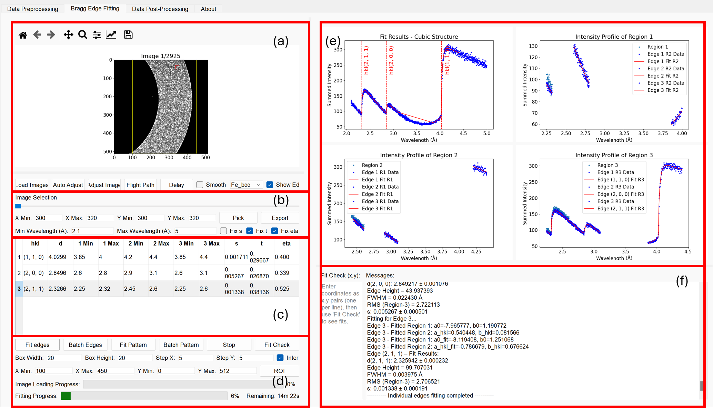

# NEAT User Manual

## A video tutorial is available on Youtube.

# 1. Introduction

## 1.1 Overview

NEAT (Neutron Bragg Edge Analysis Toolkit) is an open-source Python-based graphical user interface (GUI) designed for Bragg-edge neutron imaging data analysis. It enables users to visualise, fit, and interpret wavelength-resolved transmission data collected from neutron imaging beamlines such as IMAT (ISIS Neutron and Muon Source).

The software provides a streamlined workflow that integrates data loading, edge fitting, mapping, and batch processing — allowing both scientific and industrial users to efficiently extract quantitative information such as lattice spacing and residual strain from transmission spectra.

## 1.2 Purpose and Motivation

Bragg-edge imaging is a powerful neutron technique that reveals material structure and strain information through energy-resolved transmission. However, the analysis of such data is often time-consuming and requires specialised knowledge of fitting functions and image handling.

NEAT was developed to:

Simplify the analysis process for both new and experienced neutron users.

Provide a consistent and reproducible data analysis workflow.

Offer interactive visualisation tools to inspect transmission spectra, edge positions, and strain maps.

Facilitate collaboration and reproducibility through open-source code and transparent fitting algorithms.

## 1.3 Key Features

User-friendly GUI: intuitive layout for spectrum viewing, ROI selection, and batch analysis.

Flexible fitting functions: pseudo-Voigt model used, Jørgensen Bragg-edge models is planned to included in the future.

Result visualisation: generate maps of lattice spacing, strain, and fit quality.

Export tools: save fitted parameters and spectra as CSV.

## 1.4 Typical Workflow

Load Data: Import wavelength-resolved transmission files (.fits).

Select ROI: Choose single points or regions for analysis.

Fit Bragg Edges: Apply fitting models to extract lattice spacing.

Visualise Results: Display fitted edges and 2D maps.

Export Output: Save results for further analysis or publication.

## 1.5 Intended Users

NEAT is intended for:

Researchers and engineers performing Bragg-edge imaging experiments.

Beamline scientists conducting in-situ studies at neutron imaging facilities.

Industrial users analysing strain, phase evolution, or microstructural variations in materials.

# 2. GUI Overview

NEAT’s graphical user interface (GUI) integrates the entire Bragg-edge imaging workflow — from loading and preprocessing data to edge fitting, mapping, and post-processing — within a single interactive environment. It consists of three major tabs: data preprocessing, Bragg edge fitting, and data post processing.

## 2.1 Data Preprocessing Tab

The Data Preprocessing tab is the first step in the NEAT workflow. It consolidates all image-level corrections and normalisation steps needed before Bragg-edge fitting.
Each panel corresponds to a specific operation in the preprocessing chain, and users can execute them individually or as a complete automated batch using the Full Process module.

| **Panel**               | **Purpose**                                                                                                      |
| ----------------------- | ---------------------------------------------------------------------------------------------------------------- |
| **Summation**           | Combines multiple raw run files into one dataset to improve signal-to-noise ratio (SNR).                         |
| **Clean**               | Detects and replaces dead or hot pixels in the images using thresholding and spatial averaging.                  |
| **Overlap Correction**  | Corrects pixel pile-up effects in Timepix detectors, restoring accurate short-wavelength intensities.            |
| **Normalisation**       | Normalisation by dividing the corrected sample stack by the corrected open-beam reference.                       |
| **Filtering (Masking)** | Optionally filters data to exclude invalid regions by a binary mask.                                             |
| **Full Process**        | Automates all preprocessing steps sequentially for datasets, from summation to normalisation.                    |

## 2.2 Bragg Edge Fitting Tab

| **Section**                       | **Purpose**                                                                                                                                                                                                                          |
| --------------------------------- | ------------------------------------------------------------------------------------------------------------------------------------------------------------------------------------------------------------------------------------ |
| **(a) Viewport**                  | Displays the loaded image and allows users to define a **Region of Interest (ROI)** interactively. The ROI determines which pixels or macro-pixels are used for spectral extraction.                                                 |
| **(b) Spectrum-Extraction Panel** | Sets the **macro-pixel size** (e.g. 10 × 10 pixels) and **wavelength range** for fitting. Pressing **Pick** extracts and displays the averaged transmission spectrum from the selected ROI.                                          |
| **(c) Bragg-Edge Table**          | Lists all theoretical Bragg edges within the chosen wavelength range for the selected phase. Each row includes editable left/right/edge windows and model parameters (*s*, *t*, *η*), which can be fixed or refined.                 |
| **(d) Fitting Controls**          | Provides main fitting commands — **Fit edges** (individual three-stage fits), **Fit pattern** (multi-edge fitting with shared lattice parameter *a*), and **Batch Edges / Batch Pattern** for automated high-throughput ROI mapping. |
| **(e) Right-Hand Canvas**         | Displays extracted transmission spectra, fitted curves, and residuals. Updates occur in real time after each fit to enable rapid assessment of fit quality.                                                                          |
| **(f) Message Pane**              | Shows numerical results, fitting statistics, and diagnostic information. Also reports batch-processing progress and status messages during fitting operations.                                                                       |

## 2.3 Data Post Processing Tab