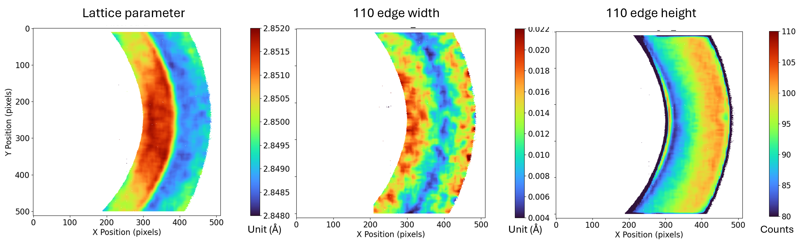

# Summary

**NEAT (Neutron Bragg-Edge Analysis Toolkit)** is an open-source graphical user interface (GUI) [@Zhang2025] that enables scientists to analyse neutron imaging data without advanced programming experience.  
Neutron imaging uses beams of neutrons to look inside solid objects in a non-destructive way, revealing the inner structure of samples through the neutrons’ interaction with the nuclei contained in the traversed object [@Santisteban2001]. When a neutron beam passes through a powder-like multi-crystalline solid, sharp changes—called *Bragg edges*—appear in the transmitted intensity as a function of neutron wavelength. The position and shape of these edges provide information about lattice spacing, elastic strain, phase composition, and microstructure [@Ramadhan2022].

**NEAT** offers a complete and user-friendly environment to transform raw neutron time-of-flight images acquired through spatially and temporally resolving detector such as the Berkeley-developed MCP-based detector [@Tremsin2020] in use at ISIS neutron and muon source [@Kockelmann2018] into quantitative maps of material properties. It combines data cleaning, correction, fitting, and visualisation steps into a single tool, reducing the need for multiple scripts or external software. NEAT adopts key aspects of the data-analysis workflow presented in Ramadhan’s doctoral thesis [@Ramadhan2019]. 
The program is particularly suited for experiments performed at energy-resolved neutron imaging instruments such as **IMAT (ISIS, UK)**, but can also be used with data from similar facilities worldwide like **RADEN (J-PARC, Japan)** [@Shinohara2016], and **POLDI (PSI, Swiss)** [@Polatidis2020], where the data pipeline is broadly similar given the use of temporally resolving detector.

# Statement of Need

Bragg-edge neutron imaging (NBEI) is increasingly used to study residual stress, deformation, and phase transformation in engineering components, cultural artefacts, and advanced manufactured parts. Despite its growing importance, analysis tools remain fragmented—often requiring manual scripting for each stage of data processing.  

Existing packages such as **RITS** [@Sato2011], **TPX\_EdgeFit** [@Tremsin2011], **BEATRIX** [@Minniti2019], **BEAn** [@Liptak2019], and **iBeatles** [@Bilheux2025] address parts of the workflow, but none integrate pre-processing, fitting, and map visualisation in one open-source, cross-platform environment.

**NEAT** was developed to fill this gap by providing:
- A consolidated pipeline from raw detector frames to strain or phase maps, all within a single GUI;
- A robust analytical model and a modified three-stage optimisation strategy for stable fitting. By using a **pseudo-Voigt Bragg-edge function**, a standard in the field, it also allows users to directly compare NEAT’s output to any other similar software;
- A *pattern-fitting* mode that refines multiple edges simultaneously to obtain a global lattice parameter, analogous to Pawley refinement in diffraction;
- High-throughput mapping with **pixel-skip** and **macro-pixel** options for rapid feedback during beamtime.

Validation on benchmark iron samples at the IMAT beamline demonstrated that NEAT accurately reproduced the expected tensile–compressive strain fields and microstructural variations, while reducing analysis time from hours to minutes.  
The tool has since been applied to projects on additively manufactured superalloys, residual-stress mapping, and cultural-heritage specimens.

# Software Design

NEAT is designed as a GUI-first, streamlined end-to-end workflow for Bragg-edge imaging users, covering data preprocessing, Bragg-edge fitting, and result illustration in one consistent pipeline. By avoiding multiple software packages and bespoke scripts, it lowers the barrier for new users, reduces training time, and improves reproducibility while still exposing key choices (e.g., preprocessing, fitting model, mapping resolution).

To accelerate routine work, NEAT provides batch preprocessing, enabling multiple datasets to be processed in a single run with consistent settings.

For rapid mapping during beamtime, NEAT supports high-throughput fitting via macro-pixel and pixel-skip options, trading spatial resolution for speed. The reduced time-to-map helps users evaluate results quickly and optimize experiments while on the beamline.

Fitting is based on a pseudo-Voigt Bragg-edge model with a three-stage optimization strategy to improve accuracy and repeatability, especially for noisy or low-count pixels. A multi-edge pattern-fitting mode further stabilizes lattice-parameter estimates by fitting multiple edges jointly, analogous to diffraction-style pattern refinement.

# Research Impact Statement

NEAT has demonstrated realized impact through validated analyses on benchmark iron samples [@Haribabu2024] at the IMAT beamline, where it reproduced expected tensile and compressive strain fields and microstructural variations while reducing analysis time from hours to minutes (*Figure 1*). It is now used in multiple ongoing IMAT experiments, including composition studies in battery electrolytes and strain mapping in Eurofer97 steel (a fusion-reactor material), showing that the tool generalizes across materials and use cases. The reduced time-to-map enables decisions during beamtime and shortens iteration cycles for experiments.

In the near term, NEAT provides a novel capability for the community: a reproducible, end-to-end Bragg-edge imaging analysis pipeline that integrates preprocessing, fitting, and mapping in a single open-source tool. The project includes user-facing **user manual** (https://github.com/RayZhang2024/NEAT/blob/main/User%20manual.md), lowering the barrier for users to adopt consistent analysis practices across different facilities. By standardizing a workflow that previously required multiple scripts and tools, NEAT enables more reliable, shareable results and accelerates experimental feedback during beamtime.

**Figure 1:** From left to right, fitted lattice parameter, 110 edge width and 110 edge height of the U-shape bent sample.

# Acknowledgements

This work was supported by the **Engineering and Imaging Group** at the **ISIS Neutron and Muon Source**, Science and Technology Facilities Council (STFC), United Kingdom.  
The authors thank **Computing Division** at ISIS Neutron and Muon Source and **Scientific Computing Department** of STFC for their technical support, and the **IMAT user community** for their valuable feedback during development and testing.

# AI Usage Disclosure

AI tools (including ChatGPT and Codex) were used to assist with drafting and refining portions of the code. The core methodology, underlying equations, and overall design were developed by the authors. Most functions were implemented and tested by the authors and users to the best of their ability. ChatGPT was also used to help improve the clarity and language of this manuscript.

# References
